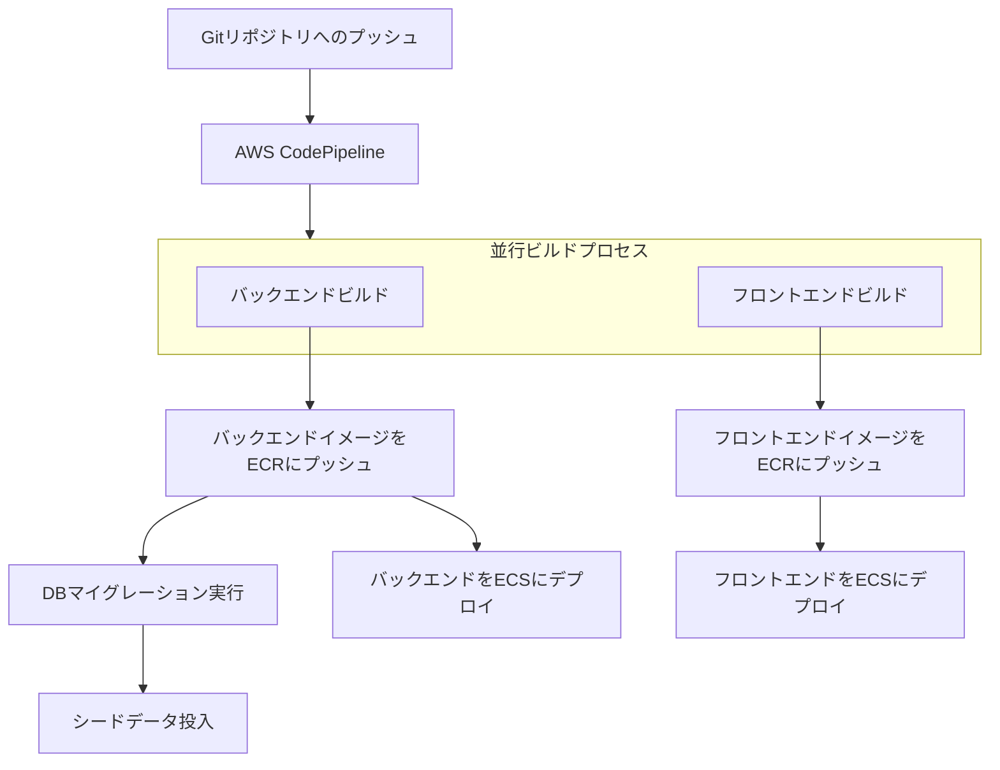

# デプロイメントプロセス

## 概要

QuanteeAdプロジェクトは、AWS上にDockerコンテナとして展開されるマイクロサービスアーキテクチャを採用しています。フロントエンドとバックエンドは別々のコンテナとしてビルド・デプロイされ、AWS CodePipelineを使用したCI/CDパイプラインによって自動化されています。

## デプロイフロー

このプロジェクトのデプロイフローは以下のように構成されています：

## 重要なファイル

デプロイプロセスを理解・修正する際には、以下のファイルを特に注視する必要があります：

### Dockerfiles

1. **Dockerfile.frontend**
   - フロントエンド（Next.js）のビルドとデプロイに使用
   - マルチステージビルド：ビルド環境と本番環境を分離
   - 環境変数（ENVIRONMENT, NEXT_PUBLIC_CLOUDFRONT_DOMAIN, NEXT_PUBLIC_ADOBE_CLIENT_ID）の設定
   - ポート3000でNext.jsアプリケーションを起動

2. **Dockerfile.backend**
   - バックエンド（NestJS）のビルドとデプロイに使用
   - マルチステージビルド構成
   - 環境変数（ENVIRONMENT）の設定
   - メモリ制限設定（--max-old-space-size=6144）付きでNode.jsアプリケーションを起動

### BuildSpec設定

1. **buildspec_frontend.yml**
   - フロントエンドのCI/CDパイプライン設定
   - インストール、ビルド、デプロイフェーズを定義
   - AWS ECRへのログインとイメージのプッシュ
   - 環境変数を使用したDockerビルド引数の設定
   - ECSデプロイ用のimagedefinitions.jsonの生成

2. **buildspec_backend.yml**
   - バックエンドのCI/CDパイプライン設定
   - インストール、ビルド、デプロイフェーズを定義
   - データベースマイグレーションとシードデータ投入を実行
   - AWS ECRへのログインとイメージのプッシュ
   - ECSデプロイ用のimagedefinitions.jsonの生成

## 環境変数

デプロイプロセスでは、以下の重要な環境変数が使用されています：

### 共通
- `ENVIRONMENT`: 環境識別子（dev, stg, prod等）
- `IMAGE_TAG`: コンテナイメージのタグ
- `IMAGE_REPO_URL`: ECRレポジトリURL
- `AWS_REGION`: AWSリージョン
- `AWS_ACCOUNT_ID`: AWSアカウントID

### フロントエンド特有
- `NEXT_PUBLIC_CLOUDFRONT_DOMAIN`: CloudFrontのドメイン
- `NEXT_PUBLIC_ADOBE_CLIENT_ID`: Adobe APIのクライアントID

## デプロイ後の処理

バックエンドのデプロイプロセスでは、イメージのビルドとプッシュ後に以下の追加タスクが実行されます：

1. **データベースマイグレーション** (`yarn prisma migrate deploy`)
   - Prismaを使用したスキーマ変更の適用

2. **シードデータ投入** (`yarn seed:prod`)
   - 本番環境用の初期データ設定

## インフラストラクチャ

デプロイ先のインフラストラクチャはTerraformで管理されています。関連するTerraform設定は以下のディレクトリにあります：

- `terraform/modules/ap-northeast-1/codeBuild/`: CodeBuildの設定
- `terraform/modules/ap-northeast-1/ecs/`: ECSの設定
- `terraform/modules/ap-northeast-1/ecr/`: ECRの設定

## デプロイに関する注意点

1. **マイグレーション順序**
   - バックエンドデプロイ時、コンテナデプロイ前にマイグレーションが実行されます
   - マイグレーションに失敗した場合、デプロイプロセス全体が失敗します

2. **環境変数管理**
   - 環境変数はCodePipelineで設定され、BuildSpecとDockerfileに渡されます
   - 新しい環境変数を追加する際はパイプライン設定とDockerfileの両方を更新する必要があります

3. **マルチステージビルド**
   - 本番イメージサイズを最小化するためマルチステージビルドを使用しています
   - 依存関係インストールとビルドは最初のステージで行われ、成果物のみが本番イメージにコピーされます

## AI支援時のデプロイ作業

AIにデプロイ関連のタスクを依頼する際は、以下の点に注意してください：

1. **変更対象の明確化**
   - `Dockerfile.frontend`, `Dockerfile.backend`, `buildspec_frontend.yml`, `buildspec_backend.yml` の変更内容を明確に指示する
   - 環境変数の追加や変更がある場合は、全ての関連ファイルでの変更箇所を確認する

2. **デプロイフローへの影響**
   - コードの変更がデプロイプロセスに与える影響を考慮する
   - 特にマイグレーションやシードデータに影響する変更には注意が必要

3. **環境固有の設定**
   - 環境固有（dev/stg/prod）の設定や条件分岐がある場合は明示的に指示する

4. **ビルド順序と依存関係**
   - フロントエンドとバックエンドの依存関係を考慮する
   - ビルドプロセスの順序に影響する変更には特に注意する

AIは必ず上記の4つのファイルを精査してから、デプロイ関連のタスクを実行するようにしてください。
