## 重要なルール
- あなたはDB設計のプロです。
- 常に現状のDB設計に沿って実装をします。
- ORMはPrismaを採用しています。
- @schema.prisma を編集、マイグレーションを行った場合は必ず下記に記したER図も更新するようにしてください。

## ER図

```mermaid
erDiagram
    User ||--o{ User : "createdBy/updatedBy関連"
    User }|--o{ Tenant : "belongs to"
    User }|--o{ UserAccount : "has many"
    User }|--o{ UserProject : "has many"
    User ||--o{ Account : "createdBy/updatedBy関連"
    User ||--o{ Project : "createdBy/updatedBy関連"
    User ||--o{ CvSetting : "createdBy/updatedBy関連"
    User ||--o{ Ad : "createdBy/updatedBy関連"
    User ||--o{ AdAccount : "createdBy関連"
    User ||--o{ Invitation : "createdBy/updatedBy/invitedUser関連"
    User ||--o{ Metric : "createdBy/updatedBy関連"
    User ||--o{ Fee : "createdBy/updatedBy関連"
    
    Tenant ||--o{ User : "has many"
    Tenant ||--o{ Account : "has many"
    Tenant ||--o{ Project : "has many"
    Tenant ||--o{ Invitation : "has many"
    
    Account ||--o{ Project : "has many"
    Account ||--o{ UserAccount : "has many"
    Account ||--o{ Invitation : "has many"
    
    Project ||--o{ Ad : "has many"
    Project ||--o{ AdAccount : "has many"
    Project ||--o{ AdAsset : "has many"
    Project ||--o{ AdsApiCallHistory : "has many"
    Project ||--o{ AnalysisGroup : "has many"
    Project ||--o{ AudienceInfo : "has many"
    Project ||--o{ ConversionLog : "has many"
    Project ||--o{ CvSetting : "has many"
    Project ||--o{ Invitation : "has many"
    Project ||--o{ Keyword : "has many"
    Project ||--o{ Metric : "has many"
    Project ||--o{ MetricSet : "has many"
    Project ||--o{ OfflineConversionLog : "has many"
    Project ||--o{ ProductInfo : "has many"
    Project ||--o{ UserProject : "has many"
    
    UserAccount }|--|| User : "belongs to"
    UserAccount }|--|| Account : "belongs to"
    
    UserProject }|--|| User : "belongs to"
    UserProject }|--|| Project : "belongs to"
    
    Invitation }o--|| Account : "may belong to"
    Invitation }o--|| Project : "may belong to"
    Invitation }o--|| Tenant : "may belong to"
    Invitation }|--|| User : "invited user"
    
    AdPlatform ||--o{ AdAccount : "has many"
    AdPlatform ||--o{ AdType : "has many"
    AdPlatform ||--o{ ConversionLog : "has many"
    AdPlatform ||--o{ SubAdPlatform : "has many"
    
    SubAdPlatform }|--|| AdPlatform : "belongs to"
    
    AdType ||--o{ Ad : "has many"
    AdType }|--|| AdPlatform : "belongs to"
    
    AdCampaign ||--o{ AdGroup : "has many"
    AdCampaign }|--|| AdAccount : "belongs to"
    
    AdGroup }|--|| AdCampaign : "belongs to"
    
    Ad }|--|| AdType : "has type"
    Ad }|--|| Project : "belongs to"
    Ad ||--o{ AdAsset : "has many"
    
    AdAccount }|--|| Project : "belongs to"
    AdAccount }|--|| AdPlatform : "has platform"
    AdAccount ||--o{ AdCampaign : "has many"
    AdAccount ||--o{ AdsApiCallHistory : "has many"
    AdAccount ||--o{ TargetConversion : "has many"
    AdAccount ||--o{ Fee : "has many"
    
    Fee }|--|| AdAccount : "belongs to"
    
    AdAsset }o--|| Ad : "may belong to"
    AdAsset }|--|| Project : "belongs to"
    AdAsset }o--|| AdAssetImage : "may have"
    AdAsset }o--|| AdAssetVideo : "may have"
    AdAsset }o--|| AdAssetText : "may have"
    
    AdAssetImage ||--o{ AdAsset : "has asset"
    AdAssetVideo ||--o{ AdAsset : "has asset"
    AdAssetText ||--o{ AdAsset : "has asset"
    
    ProductInfo }|--|| Project : "belongs to"
    AudienceInfo }|--|| Project : "belongs to"
    Keyword }|--|| Project : "belongs to"
    
    Metric }|--|| Project : "belongs to"
    Metric ||--o{ Metric : "derived from"
    Metric ||--o{ MetricSet : "used in (1)"
    Metric ||--o{ MetricSet : "used in (2)"
    Metric ||--o{ OfflineMetric : "calculation (1)"
    Metric ||--o{ OfflineMetric : "calculation (2)"
    Metric ||--|| OfflineMetric : "has one"
    Metric ||--|| OnlineMetric : "has one"
    
    OfflineMetric ||--o{ OfflineConversionLog : "has many"
    OfflineMetric ||--o{ TargetConversion : "has many"
    OfflineMetric }|--|| Metric : "belongs to"
    OfflineMetric }o--o| Metric : "calculation metric 1"
    OfflineMetric }o--o| Metric : "calculation metric 2"
    
    TargetConversion }|--|| OfflineMetric : "belongs to"
    TargetConversion }|--|| AdAccount : "belongs to"
    
    OnlineMetric }|--|| Metric : "belongs to"
    
    AnalysisGroup }|--|| Project : "belongs to"
    
    CvSetting }|--|| Project : "belongs to"
    CvSetting ||--o{ ConversionLog : "has many"
    CvSetting ||--|| ExternalToolCvSetting : "has one"
    CvSetting ||--|| TagCvSetting : "has one"
    
    TagCvSetting }|--|| CvSetting : "belongs to"
    TagCvSetting ||--o{ TagCvAdditionalValue : "has many"
    
    ExternalToolCvSetting }|--|| CvSetting : "belongs to"
    
    TagCvAdditionalValue }|--|| TagCvSetting : "belongs to"
    
    ConversionLog }|--|| Project : "belongs to"
    ConversionLog }o--|| CvSetting : "may belong to"
    ConversionLog }|--|| AdPlatform : "has platform"
    ConversionLog ||--o{ OfflineConversionLog : "has many"
    
    OfflineConversionLog }|--|| ConversionLog : "belongs to"
    OfflineConversionLog }|--|| OfflineMetric : "has metric"
    OfflineConversionLog }|--|| Project : "belongs to"
    
    MetricSet }|--|| Project : "belongs to"
    MetricSet }|--|| Metric : "metric 1"
    MetricSet }|--|| Metric : "metric 2"
    
    AdsApiCallHistory }|--|| Project : "belongs to"
    AdsApiCallHistory }|--|| AdAccount : "belongs to"
```

以下は各エンティティの主要属性です：

### User
- id, tenantId, name, email, phoneNumber, tenantRole, createdAt, updatedAt
- テナントに所属し、アカウントやプロジェクトにアクセス権を持つ

### Tenant
- id, name, imageUrl, isAgency, createdAt, updatedAt
- 組織を表し、複数のアカウントとユーザーを保持できる

### Account
- id, tenantId, name, imageUrl, closingMonth, createdAt, updatedAt
- テナント内の会計単位、複数のプロジェクトを持つ

### Project
- id, accountId, tenantId, name, imageUrl, dispOrder, createdAt, updatedAt
- 広告管理の中心的な単位、広告やメトリクスなど多くのリソースを持つ

### AdAccount
- id, name, projectId, adPlatformId, platformAdAccountId, accessToken, refreshToken
- 外部広告プラットフォームとの連携を管理

### Ad
- id, name, status, origin, adTypeId, projectId, createdAt, updatedAt
- プロジェクト内の広告を表現

### Metric
- id, name, projectId, type, unit, sourceMetricId, isShowInSummary, isShowInComparison
- オンライン/オフラインのメトリクスを測定、表示するための設定

### CvSetting
- id, projectId, name, cvSource, createdAt, updatedAt, lastTriggeredAt
- コンバージョン設定を管理

### ConversionLog
- id, projectId, cvSettingId, adPlatformId, clickId, status, data
- コンバージョンイベントのログを保持

### OfflineMetric
- id, dataRetrievalSetting, manualInputStyle, calculationMetric1Id, calculationMetric2Id, operator
- オフラインでの指標測定に関する設定を管理

### OnlineMetric
- id (Metricと同じID)
- オンラインでの指標測定に関する設定

### TargetConversion
- id, offlineMetricId, adAccountId, platformConversionId, conversionName, conversionValue, conversionType
- 広告アカウントの特定のコンバージョン目標を管理

### OfflineConversionLog
- conversionLogId, offlineMetricId, projectId, value
- オフラインコンバージョンの詳細データを保持

### AdPlatform
- id, name, order, icon
- サポートされている広告プラットフォーム（Meta, Google, Yahoo, Tiktokなど）

### SubAdPlatform
- id, name, order, icon, adPlatformId
- メイン広告プラットフォームのサブカテゴリ

### AdType
- id, adPlatformId, name, order, icon
- 広告プラットフォームで使用される広告タイプ

### AdCampaign
- id, adAccountId, name, status
- 広告アカウント内のキャンペーン情報

### AdGroup
- id, adCampaignId, name, status
- 広告キャンペーン内の広告グループ

### AdAsset
- id, type, projectId, adId, url, fileName, fileType
- 広告に使用されるアセット（画像、動画、テキストなど）

### AdAssetImage
- id, width, height
- 画像アセットの詳細情報

### AdAssetVideo
- id, duration, youtubeVideoId, youtubeVideoTitle
- 動画アセットの詳細情報

### AdAssetText
- id, text, type
- テキストアセットの詳細情報

### ProductInfo
- id, projectId, name, content
- プロジェクトの製品情報

### AudienceInfo
- id, projectId, name, content
- ターゲットオーディエンス情報

### Keyword
- id, projectId, name, content
- プロジェクトに関連するキーワード

### AnalysisGroup
- id, name, description, campaignIds, projectId
- 分析のためのキャンペーングループ

### MetricSet
- id, projectId, metricId1, metricId2, displayOrder
- メトリック比較のための組み合わせセット

### TagCvSetting
- id, cvSettingId, tagType, formLocationUrl, postConversionUrl, formId
- タグベースのコンバージョン設定

### ExternalToolCvSetting
- id, cvSettingId, externalToolName, externalToolApiUrl, apiKey, email, password
- 外部ツールを利用したコンバージョン設定

### TagCvAdditionalValue
- id, tagCvSettingId, key, displayName
- タグコンバージョン設定の追加パラメータ

### AdsApiCallHistory
- id, projectId, adAccountId, endpoint, payload, response, startDate, endDate, expiredAt
- 外部広告APIへの呼び出し履歴

### Fee
- id, adAccountId, year, month, feeRate
- 広告アカウントの料金設定

### UserAccount
- userId, accountId, role, userDispOrder
- ユーザーとアカウントの関連付け、権限管理

### UserProject
- userId, projectId, role, userDispOrder
- ユーザーとプロジェクトの関連付け、権限管理

### Invitation
- id, tenantId, accountId, projectId, email, inviteTo, role, status, expiresAt, token, invitedUserId
- ユーザー招待の管理

