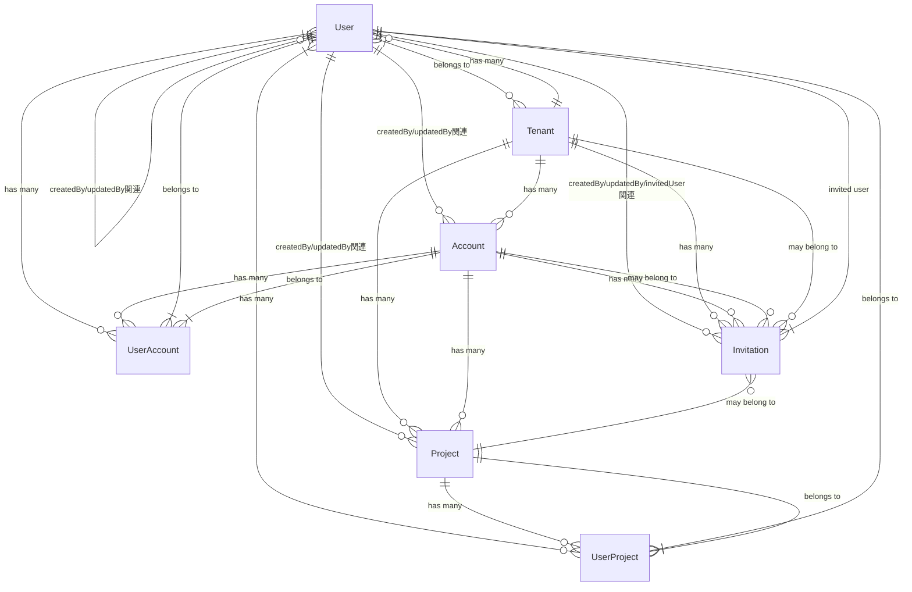

### DBに関する重要なルール
- あなたはDB設計のプロです。
- 常に現状のDB設計に沿って実装をします。
- ORMはPrismaを採用しています。
- schema.prismaは、/prisma内に定義されています。
- schema.prismaを編集、マイグレーションを行った場合は必ず下記に記したER図も更新するようにしてください。
- migrationは必ず

### ER図

以下は各エンティティの主要属性です：

### User
- id, tenantId, name, email, phoneNumber, tenantRole, createdAt, updatedAt
- テナントに所属し、アカウントやプロジェクトにアクセス権を持つ

### Tenant
- id, name, imageUrl, isAgency, createdAt, updatedAt
- 組織を表し、複数のアカウントとユーザーを保持できる

### Account
- id, tenantId, name, imageUrl, closingMonth, createdAt, updatedAt
- テナント内の会計単位、複数のプロジェクトを持つ

### Project
- id, accountId, tenantId, name, imageUrl, dispOrder, createdAt, updatedAt
- 広告管理の中心的な単位、広告やメトリクスなど多くのリソースを持つ

### UserAccount
- userId, accountId, role
- ユーザーとアカウントの関連付け、権限管理

### UserProject
- userId, projectId, role
- ユーザーとプロジェクトの関連付け、権限管理

### Invitation
- id, tenantId, accountId, projectId, email, inviteTo, role, status, expiresAt, token, invitedUserId
- ユーザー招待の管理

