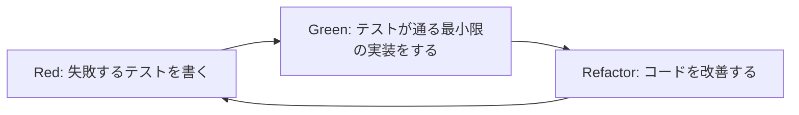
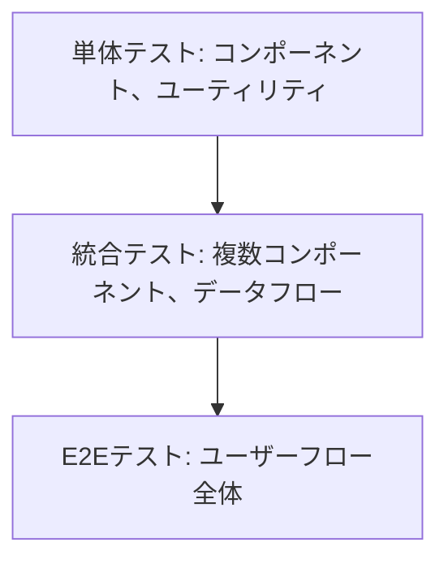
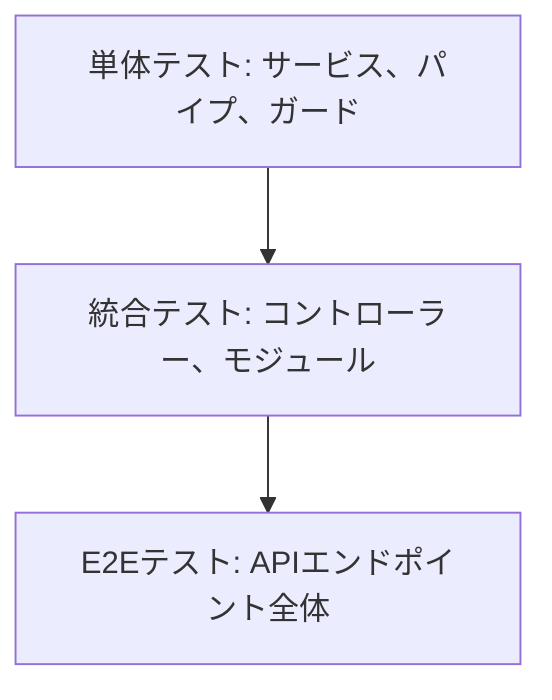

## テスト駆動開発 (TDD) ルール

テスト駆動開発 (Test-Driven Development) は、コードを書く前にテストを書くソフトウェア開発手法です。この方法論を採用することで、設計の質を高め、バグの少ないコードを作成し、リファクタリングを安全に行うことができます。

## TDDの基本サイクル



1. **Red**: まず失敗するテストを書く

   - 必要な機能を明確に定義
   - 期待する振る舞いをテストコードで表現
   - この時点ではテストは失敗する（赤）

2. **Green**: テストが通るように最小限の実装をする

   - テストをパスさせるための最も単純な実装を行う
   - パフォーマンスやコードの美しさより機能性を優先
   - この時点でテストは成功する（緑）

3. **Refactor**: コードをリファクタリングして改善する
   - 重複を排除し、コードを整理
   - 可読性とメンテナンス性を向上
   - テストが依然として通ることを確認

## TDDの重要な考え方

- **テストは仕様である**: テストコードは実装の仕様を表現したもの
- **最初に「何を」考え、次に「どのように」考える**: テストで「何を」達成すべきかを明確にしてから、「どのように」実装するかを考える
- **小さなステップで進める**: 一度に大きな変更を行わず、小さな一歩ずつ進める
- **テストカバレッジより意図のカバレッジを重視**: 単にコードラインをカバーするだけでなく、ビジネスロジックの意図を正確にテストする

## テスト構造の原則

### AAA (Arrange-Act-Assert) パターン

テストコードは以下の3つのセクションで構成することをお勧めします：

1. **Arrange (準備)**: テストの前提条件を設定
2. **Act (実行)**: テスト対象の機能を実行
3. **Assert (検証)**: 期待する結果を検証

```typescript
// Jest を使用した例
describe('UserService', () => {
  it('should return user by id when user exists', async () => {
    // Arrange
    const mockUser = { id: 1, name: 'John Doe' };
    const userRepositoryMock = {
      findById: jest.fn().mockResolvedValue(mockUser),
    };
    const userService = new UserService(userRepositoryMock);

    // Act
    const result = await userService.getUserById(1);

    // Assert
    expect(result).toEqual(mockUser);
    expect(userRepositoryMock.findById).toHaveBeenCalledWith(1);
  });
});
```

### テスト名の命名規則

良いテスト名は「状況→操作→結果」の形式で記述します：

```typescript
it('有効なユーザーIDが提供された場合_getUserByIdを呼び出すと_ユーザー情報を返すこと', async () => {
  // テスト本体
});

// または英語で
it('should return user information when getUserById is called with valid user ID', async () => {
  // テスト本体
});
```

## フロントエンドとバックエンドのテスト戦略

### Next.jsフロントエンドのテスト階層



#### 単体テスト (Jest + React Testing Library)

```typescript
// components/Button.test.tsx
import { render, screen, fireEvent } from '@testing-library/react';
import Button from './Button';

describe('Button', () => {
  it('renders correctly with text', () => {
    render(<Button>Click me</Button>);
    expect(screen.getByText('Click me')).toBeInTheDocument();
  });

  it('calls onClick handler when clicked', () => {
    const handleClick = jest.fn();
    render(<Button onClick={handleClick}>Click me</Button>);
    fireEvent.click(screen.getByText('Click me'));
    expect(handleClick).toHaveBeenCalledTimes(1);
  });
});
```

#### 統合テスト

```typescript
// features/UserProfile.test.tsx
import { render, screen, waitFor } from '@testing-library/react';
import UserProfile from './UserProfile';
import { UserProvider } from '../contexts/UserContext';

// モックの設定
jest.mock('../api/user', () => ({
  fetchUserData: jest.fn().mockResolvedValue({ name: 'John Doe', email: 'john@example.com' })
}));

describe('UserProfile', () => {
  it('fetches and displays user data', async () => {
    render(
      <UserProvider>
        <UserProfile userId="123" />
      </UserProvider>
    );

    // ローディング状態の確認
    expect(screen.getByText('Loading...')).toBeInTheDocument();

    // データ取得後の表示確認
    await waitFor(() => {
      expect(screen.getByText('John Doe')).toBeInTheDocument();
      expect(screen.getByText('john@example.com')).toBeInTheDocument();
    });
  });
});
```

#### E2Eテスト (Cypress)

```typescript
// cypress/e2e/login.cy.ts
describe('Login Flow', () => {
  it('allows user to login and redirects to dashboard', () => {
    cy.visit('/login');

    cy.get('input[name="email"]').type('user@example.com');
    cy.get('input[name="password"]').type('password123');
    cy.get('button[type="submit"]').click();

    // ダッシュボードへのリダイレクトと表示確認
    cy.url().should('include', '/dashboard');
    cy.get('h1').should('contain', 'Welcome to your Dashboard');
  });
});
```

### NestJSバックエンドのテスト階層



#### 単体テスト (Jest)

```typescript
// users/users.service.spec.ts
import { Test } from '@nestjs/testing';
import { UsersService } from './users.service';
import { UsersRepository } from './users.repository';

describe('UsersService', () => {
  let usersService: UsersService;
  let usersRepository: UsersRepository;

  beforeEach(async () => {
    const moduleRef = await Test.createTestingModule({
      providers: [
        UsersService,
        {
          provide: UsersRepository,
          useValue: {
            findById: jest.fn(),
            save: jest.fn(),
          },
        },
      ],
    }).compile();

    usersService = moduleRef.get<UsersService>(UsersService);
    usersRepository = moduleRef.get<UsersRepository>(UsersRepository);
  });

  describe('findById', () => {
    it('should return a user when user exists', async () => {
      const mockUser = { id: 1, name: 'John Doe' };
      jest.spyOn(usersRepository, 'findById').mockResolvedValue(mockUser);

      const result = await usersService.findById(1);

      expect(result).toEqual(mockUser);
      expect(usersRepository.findById).toHaveBeenCalledWith(1);
    });
  });
});
```

#### 統合テスト (NestJS Testing)

```typescript
// users/users.controller.spec.ts
import { Test } from '@nestjs/testing';
import { UsersController } from './users.controller';
import { UsersService } from './users.service';

describe('UsersController', () => {
  let usersController: UsersController;
  let usersService: UsersService;

  beforeEach(async () => {
    const moduleRef = await Test.createTestingModule({
      controllers: [UsersController],
      providers: [
        {
          provide: UsersService,
          useValue: {
            findById: jest.fn(),
            create: jest.fn(),
          },
        },
      ],
    }).compile();

    usersController = moduleRef.get<UsersController>(UsersController);
    usersService = moduleRef.get<UsersService>(UsersService);
  });

  describe('findById', () => {
    it('should return a user', async () => {
      const mockUser = { id: 1, name: 'John Doe' };
      jest.spyOn(usersService, 'findById').mockResolvedValue(mockUser);

      const result = await usersController.findById('1');

      expect(result).toEqual(mockUser);
    });
  });
});
```

#### E2Eテスト (SuperTest)

```typescript
// test/users.e2e-spec.ts
import { Test } from '@nestjs/testing';
import { INestApplication } from '@nestjs/common';
import * as request from 'supertest';
import { AppModule } from '../src/app.module';

describe('UsersController (e2e)', () => {
  let app: INestApplication;

  beforeAll(async () => {
    const moduleFixture = await Test.createTestingModule({
      imports: [AppModule],
    }).compile();

    app = moduleFixture.createNestApplication();
    await app.init();
  });

  afterAll(async () => {
    await app.close();
  });

  it('/users/:id (GET)', () => {
    return request(app.getHttpServer())
      .get('/users/1')
      .expect(200)
      .expect((res) => {
        expect(res.body).toHaveProperty('id');
        expect(res.body).toHaveProperty('name');
      });
  });
});
```

## 並行テスト実行

大規模なテストスイートでは、テスト実行時間を短縮するために並行実行が有効です。

### Jestでの並行テスト実行

```json
// jest.config.js
module.exports = {
  // ...他の設定
  maxWorkers: '50%', // CPUコアの50%を使用
  // または
  maxWorkers: 4, // 固定ワーカー数
};
```

### 並行テスト実行の注意点

1. **テスト間の独立性確保**

   - テストは他のテストに依存しないこと
   - 共有リソース（DBなど）へのアクセスを適切に分離

2. **データ分離**

   - テスト用DBの分離またはトランザクションのロールバック
   - テスト前後のデータクリーンアップ

3. **リソース競合の回避**
   - ファイル操作やポート使用の競合に注意
   - 環境変数の競合回避

```typescript
// マルチテナントDB環境でのテスト分離の例
beforeEach(async () => {
  // テスト用のスキーマを動的に生成
  const schemaName = `test_${Math.random().toString(36).substring(2, 7)}`;
  await db.query(`CREATE SCHEMA IF NOT EXISTS ${schemaName}`);
  await db.query(`SET search_path TO ${schemaName},public`);

  // マイグレーション実行
  await runMigrations(schemaName);

  // このテストのコンテキストにスキーマ名を保存
  testContext.schemaName = schemaName;
});

afterEach(async () => {
  // テスト用スキーマを削除
  await db.query(`DROP SCHEMA IF EXISTS ${testContext.schemaName} CASCADE`);
});
```

## モックとスタブ

### 外部依存のモック化

```typescript
// ユーザーサービスのテスト
describe('UsersService', () => {
  it('should send welcome email when user is created', async () => {
    // EmailServiceのモック
    const emailServiceMock = {
      sendWelcomeEmail: jest.fn().mockResolvedValue(true),
    };

    const usersService = new UsersService(userRepositoryMock, emailServiceMock);

    await usersService.createUser({ name: 'John', email: 'john@example.com' });

    // EmailServiceが正しく呼び出されたか検証
    expect(emailServiceMock.sendWelcomeEmail).toHaveBeenCalledWith('john@example.com', 'John');
  });
});
```

### データベースのモック化

Prismaを使用する場合は、`jest-mock-extended`や`@prisma/client/testing`を使用して効果的にモックできます：

```typescript
// Prismaクライアントのモック
import { PrismaClient } from '@prisma/client';
import { mockDeep, mockReset, DeepMockProxy } from 'jest-mock-extended';

jest.mock('@prisma/client', () => ({
  PrismaClient: jest.fn(),
}));

let prisma: DeepMockProxy<PrismaClient>;

beforeEach(() => {
  prisma = mockDeep<PrismaClient>();
  (PrismaClient as jest.Mock).mockImplementation(() => prisma);
});

test('should create a new user', async () => {
  const mockUser = { id: 1, name: 'John', email: 'john@example.com' };
  prisma.user.create.mockResolvedValue(mockUser);

  const userService = new UserService(prisma);
  const result = await userService.createUser({ name: 'John', email: 'john@example.com' });

  expect(result).toEqual(mockUser);
  expect(prisma.user.create).toHaveBeenCalledWith({
    data: { name: 'John', email: 'john@example.com' },
  });
});
```

## テストリファクタリング

テストコード自体も定期的にリファクタリングすることが大切です：

### DRYなテストコード

```typescript
// テスト前の共通セットアップ
function createUserService(overrides = {}) {
  return new UserService({
    userRepository: { findById: jest.fn(), save: jest.fn() },
    emailService: { sendWelcomeEmail: jest.fn() },
    ...overrides,
  });
}

describe('UserService', () => {
  it('should find user by id', async () => {
    const mockUser = { id: 1, name: 'John' };
    const mockUserRepo = { findById: jest.fn().mockResolvedValue(mockUser) };
    const userService = createUserService({ userRepository: mockUserRepo });

    const result = await userService.findById(1);

    expect(result).toEqual(mockUser);
  });

  // 他のテスト...
});
```

### テストヘルパー関数

```typescript
// テストユーティリティ
function createTestUser(overrides = {}) {
  return {
    id: 1,
    name: 'John Doe',
    email: 'john@example.com',
    isActive: true,
    ...overrides,
  };
}

it('should activate inactive user', async () => {
  const inactiveUser = createTestUser({ isActive: false });
  // ...テストの続き
});
```

## コードカバレッジとレポーティング

### Jestでのカバレッジ測定

```bash
# カバレッジ測定付きでテスト実行
yarn test --coverage
```

```json
// jest.config.js
module.exports = {
  // ...
  coverageThreshold: {
    global: {
      branches: 80,
      functions: 80,
      lines: 80,
      statements: 80
    }
  },
  collectCoverageFrom: [
    "src/**/*.{js,jsx,ts,tsx}",
    "!src/**/*.d.ts",
    "!src/index.{js,ts}",
    "!src/**/*.stories.{js,jsx,ts,tsx}"
  ]
};
```

## TDDの導入と習慣化

### TDDへの段階的移行

1. **既存コードへのテスト追加から始める**

   - 重要な機能やバグ修正時にまずテストを追加

2. **新機能開発にTDDを適用**

   - 新しい機能開発時にはテストファーストで進める

3. **チーム内でTDDセッションを実施**
   - ペアプログラミングやモブプログラミングでTDDを実践

### GitによるTDDの強化

TDDのサイクルに合わせたコミット戦略：

```bash
# Red: 失敗するテストを書く
git add src/user/user.service.spec.ts
git commit -m "test: Add test for user activation"

# Green: 実装を行い、テストをパスさせる
git add src/user/user.service.ts
git commit -m "feat: Implement user activation"

# Refactor: コードを改善する
git add src/user/user.service.ts
git commit -m "refactor: Improve user activation logic"
```

## NestJSとNext.jsのテスト設定

### NestJSのテスト設定

```typescript
// apps/api/jest.config.ts
module.exports = {
  displayName: 'api',
  preset: '../../jest.preset.js',
  globals: {
    'ts-jest': {
      tsconfig: '<rootDir>/tsconfig.spec.json',
    },
  },
  testEnvironment: 'node',
  transform: {
    '^.+\\.[tj]s$': 'ts-jest',
  },
  moduleFileExtensions: ['ts', 'js', 'html'],
  coverageDirectory: '../../coverage/apps/api',
};
```

### Next.jsのテスト設定

```typescript
// apps/frontend/jest.config.ts
module.exports = {
  displayName: 'frontend',
  preset: '../../jest.preset.js',
  transform: {
    '^(?!.*\\.(js|jsx|ts|tsx|css|json)$)': '@nrwl/react/plugins/jest',
    '^.+\\.[tj]sx?$': ['babel-jest', { presets: ['@nrwl/next/babel'] }],
  },
  moduleFileExtensions: ['ts', 'tsx', 'js', 'jsx'],
  coverageDirectory: '../../coverage/apps/frontend',
  setupFilesAfterEnv: ['<rootDir>/jest.setup.js'],
  testEnvironment: 'jsdom',
};
```

## まとめ

テスト駆動開発は単なる手法ではなく、品質を重視する姿勢とフィードバックを素早く得るプロセスです。TDDを習慣化することで：

1. **設計の質向上**: 必要な機能を明確に定義し、クリーンなAPIを設計
2. **バグの削減**: エッジケースやエラー処理を事前に考慮
3. **リファクタリングの安全性確保**: 既存機能を壊さずにコードを改善
4. **開発速度の向上**: 初期は遅く感じても、長期的にはバグ修正時間の削減で効率化
5. **ドキュメントとしての価値**: テストが仕様を示す生きたドキュメントとなる

新たな機能開発や既存コードの修正時には、まずテストから始めることを心がけましょう。
